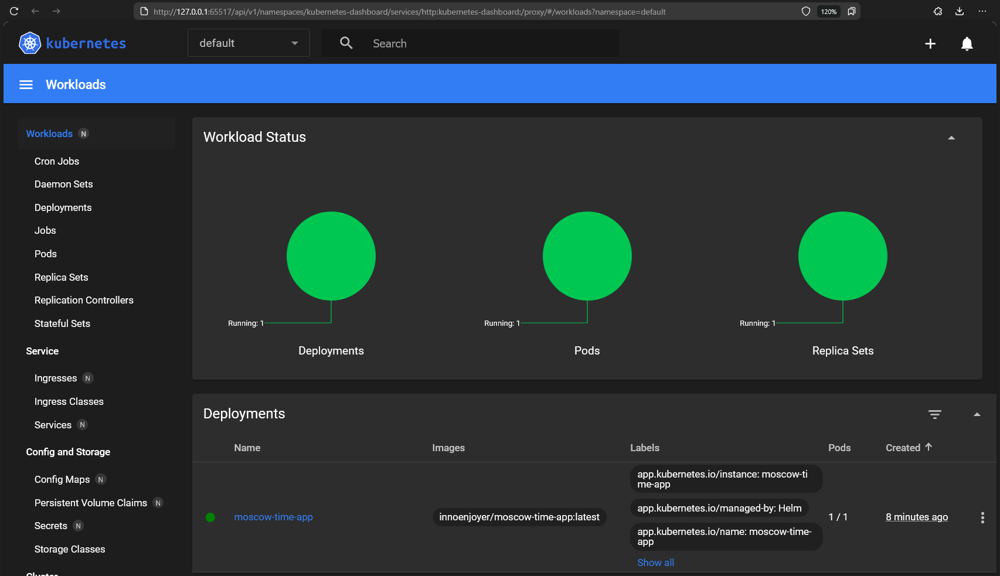

# Helm

## Helm setup

### Install Helm Chart

```shell
helm install moscow-time-app moscow-time-app
```

```text
NAME: moscow-time-app
LAST DEPLOYED: Wed Feb 26 19:29:23 2025
NAMESPACE: default
STATUS: deployed
REVISION: 1
NOTES:
1. Get the application URL by running these commands:
  export POD_NAME=$(kubectl get pods --namespace default -l "app.kubernetes.io/name=moscow-time-app,app.kubernetes.io/instance=moscow-time-app" -o jsonpath="{.items[0].metadata.name}")
  export CONTAINER_PORT=$(kubectl get pod --namespace default $POD_NAME -o jsonpath="{.spec.containers[0].ports[0].containerPort}")
  echo "Visit http://127.0.0.1:8080 to use your application"
  kubectl --namespace default port-forward $POD_NAME 8080:$CONTAINER_PORT
```

### Minikube dashboard

```shell
minikube dashboard
```

```text
* Enabling dashboard ...
  - Using image docker.io/kubernetesui/dashboard:v2.7.0
  - Using image docker.io/kubernetesui/metrics-scraper:v1.0.8
* Some dashboard features require the metrics-server addon. To enable all features please run:

        minikube addons enable metrics-server

* Verifying dashboard health ...
* Launching proxy ...
* Verifying proxy health ...
* Opening http://127.0.0.1:65517/api/v1/namespaces/kubernetes-dashboard/services/http:kubernetes-dashboard:/proxy/ in your default browser...
```



### Access Application

```shell
minikube service moscow-time-app
```

```text
|-----------|-----------------|-------------|--------------|
| NAMESPACE |      NAME       | TARGET PORT |     URL      |
|-----------|-----------------|-------------|--------------|
| default   | moscow-time-app |             | No node port |
|-----------|-----------------|-------------|--------------|
* service default/moscow-time-app has no node port
! Services [default/moscow-time-app] have type "ClusterIP" not meant to be exposed, however for local development minikube allows you to access this !
* Starting tunnel for service moscow-time-app.
|-----------|-----------------|-------------|------------------------|
| NAMESPACE |      NAME       | TARGET PORT |          URL           |
|-----------|-----------------|-------------|------------------------|
| default   | moscow-time-app |             | http://127.0.0.1:65494 |
|-----------|-----------------|-------------|------------------------|
* Opening service default/moscow-time-app in default browser...
```

### View Pods & Services

```shell
kubectl get pods,svc
```

```text
NAME                                   READY   STATUS    RESTARTS   AGE
pod/moscow-time-app-7777f76cff-wdbcc   1/1     Running   0          16m

NAME                      TYPE        CLUSTER-IP       EXTERNAL-IP   PORT(S)    AGE
service/kubernetes        ClusterIP   10.96.0.1        <none>        443/TCP    41h
service/moscow-time-app   ClusterIP   10.108.100.119   <none>        5000/TCP   16m
```

## Helm Chart Hooks

### Lint 

```shell
helm lint moscow-time-app
```

```text
==> Linting moscow-time-app
[INFO] Chart.yaml: icon is recommended

1 chart(s) linted, 0 chart(s) failed
```

### Install Hooks

```shell
helm install --dry-run helm-hooks  moscow-time-app
```

```text
NAME: helm-hooks
LAST DEPLOYED: Wed Feb 26 20:07:13 2025
NAMESPACE: default
STATUS: pending-install
REVISION: 1
HOOKS:
---
# Source: moscow-time-app/templates/post-install-hook.yaml
apiVersion: v1
kind: Pod
metadata:
   name: postinstall-hook
   annotations:
       "helm.sh/hook": "post-install"
spec:
  containers:
  - name: post-install-container
    image: busybox
    imagePullPolicy: Always
    command: ['sh', '-c', 'echo The post-install hook is running && sleep 15' ]
  restartPolicy: Never
  terminationGracePeriodSeconds: 0
---
# Source: moscow-time-app/templates/pre-install-hook.yaml
apiVersion: v1
kind: Pod
metadata:
   name: preinstall-hook
   annotations:
       "helm.sh/hook": "pre-install"
spec:
  containers:
  - name: pre-install-container
    image: busybox
    imagePullPolicy: IfNotPresent
    command: ['sh', '-c', 'echo The pre-install hook is running && sleep 20' ]
  restartPolicy: Never
  terminationGracePeriodSeconds: 0
---
# Source: moscow-time-app/templates/tests/test-connection.yaml
apiVersion: v1
kind: Pod
metadata:
  name: "helm-hooks-moscow-time-app-test-connection"
  labels:
    helm.sh/chart: moscow-time-app-0.1.0
    app.kubernetes.io/name: moscow-time-app
    app.kubernetes.io/instance: helm-hooks
    app.kubernetes.io/version: "1.16.0"
    app.kubernetes.io/managed-by: Helm
  annotations:
    "helm.sh/hook": test
spec:
  containers:
    - name: wget
      image: busybox
      command: ['wget']
      args: ['helm-hooks-moscow-time-app:5000']
  restartPolicy: Never
MANIFEST:
---
# Source: moscow-time-app/templates/serviceaccount.yaml
apiVersion: v1
kind: ServiceAccount
metadata:
  name: helm-hooks-moscow-time-app
  labels:
    helm.sh/chart: moscow-time-app-0.1.0
    app.kubernetes.io/name: moscow-time-app
    app.kubernetes.io/instance: helm-hooks
    app.kubernetes.io/version: "1.16.0"
    app.kubernetes.io/managed-by: Helm
automountServiceAccountToken: true
---
# Source: moscow-time-app/templates/service.yaml
apiVersion: v1
kind: Service
metadata:
  name: helm-hooks-moscow-time-app
  labels:
    helm.sh/chart: moscow-time-app-0.1.0
    app.kubernetes.io/name: moscow-time-app
    app.kubernetes.io/instance: helm-hooks
    app.kubernetes.io/version: "1.16.0"
    app.kubernetes.io/managed-by: Helm
spec:
  type: ClusterIP
  ports:
    - port: 5000
      targetPort: http
      protocol: TCP
      name: http
  selector:
    app.kubernetes.io/name: moscow-time-app
    app.kubernetes.io/instance: helm-hooks
---
# Source: moscow-time-app/templates/deployment.yaml
apiVersion: apps/v1
kind: Deployment
metadata:
  name: helm-hooks-moscow-time-app
  labels:
    helm.sh/chart: moscow-time-app-0.1.0
    app.kubernetes.io/name: moscow-time-app
    app.kubernetes.io/instance: helm-hooks
    app.kubernetes.io/version: "1.16.0"
    app.kubernetes.io/managed-by: Helm
spec:
  replicas: 1
  selector:
    matchLabels:
      app.kubernetes.io/name: moscow-time-app
      app.kubernetes.io/instance: helm-hooks
  template:
    metadata:
      labels:
        helm.sh/chart: moscow-time-app-0.1.0
        app.kubernetes.io/name: moscow-time-app
        app.kubernetes.io/instance: helm-hooks
        app.kubernetes.io/version: "1.16.0"
        app.kubernetes.io/managed-by: Helm
    spec:
      serviceAccountName: helm-hooks-moscow-time-app
      containers:
        - name: moscow-time-app
          image: "innoenjoyer/moscow-time-app:latest"
          imagePullPolicy: IfNotPresent
          ports:
            - name: http
              containerPort: 5000
              protocol: TCP
          livenessProbe:
            httpGet:
              path: /
              port: http
          readinessProbe:
            httpGet:
              path: /
              port: http

NOTES:
1. Get the application URL by running these commands:
  export POD_NAME=$(kubectl get pods --namespace default -l "app.kubernetes.io/name=moscow-time-app,app.kubernetes.io/instance=helm-hooks" -o jsonpath="{.items[0].metadata.name}")
  export CONTAINER_PORT=$(kubectl get pod --namespace default $POD_NAME -o jsonpath="{.spec.containers[0].ports[0].containerPort}")
  echo "Visit http://127.0.0.1:8080 to use your application"
  kubectl --namespace default port-forward $POD_NAME 8080:$CONTAINER_PORT
```

### View Pods

```shell
kubectl get po
```

```text
NAME                                         READY   STATUS        RESTARTS   AGE
helm-hooks-moscow-time-app-f45c54f6d-4cmvl   1/1     Running       0          3m13s
postinstall-hook                             0/1     Completed     0          3m13s
preinstall-hook                              0/1     Completed     0          3m42s
```

### Show pre-install hook details

```shell
kubectl describe po preinstall-hook
```

```text
Name:             preinstall-hook
Namespace:        default
Priority:         0
Service Account:  default
Node:             minikube/192.168.49.2
Start Time:       Thu, 27 Feb 2025 10:48:32 +0300
Labels:           <none>
Annotations:      helm.sh/hook: pre-install
Status:           Succeeded
IP:               10.244.0.13
IPs:
  IP:  10.244.0.13
Containers:
  pre-install-container:
    Container ID:  docker://48d68686c3ca2f58b06b99a9f5e100df38dd66b92cf31cc119a653b2c730d864
    Image:         busybox
    Image ID:      docker-pullable://busybox@sha256:498a000f370d8c37927118ed80afe8adc38d1edcbfc071627d17b25c88efcab0
    Port:          <none>
    Host Port:     <none>
    Command:
      sh
      -c
      echo The pre-install hook is running && sleep 20
    State:          Terminated
      Reason:       Completed
      Exit Code:    0
      Started:      Thu, 27 Feb 2025 10:48:38 +0300
      Finished:     Thu, 27 Feb 2025 10:48:58 +0300
    Ready:          False
    Restart Count:  0
    Environment:    <none>
    Mounts:
      /var/run/secrets/kubernetes.io/serviceaccount from kube-api-access-s6wq8 (ro)
Conditions:
  Type                        Status
  PodReadyToStartContainers   False
  Initialized                 True
  Ready                       False
  ContainersReady             False
  PodScheduled                True
Volumes:
  kube-api-access-s6wq8:
    Type:                    Projected (a volume that contains injected data from multiple sources)
    TokenExpirationSeconds:  3607
    ConfigMapName:           kube-root-ca.crt
    ConfigMapOptional:       <nil>
    DownwardAPI:             true
QoS Class:                   BestEffort
Node-Selectors:              <none>
Tolerations:                 node.kubernetes.io/not-ready:NoExecute op=Exists for 300s
                             node.kubernetes.io/unreachable:NoExecute op=Exists for 300s
Events:
  Type    Reason     Age   From               Message
  ----    ------     ----  ----               -------
  Normal  Scheduled  4m9s  default-scheduler  Successfully assigned default/preinstall-hook to minikube
  Normal  Pulling    4m7s  kubelet            Pulling image "busybox"
  Normal  Pulled     4m3s  kubelet            Successfully pulled image "busybox" in 4.465s (4.465s including waiting). Image size: 4269694 bytes.
  Normal  Created    4m3s  kubelet            Created container: pre-install-container
  Normal  Started    4m3s  kubelet            Started container pre-install-container
```

### Show post-install hook details

```shell
kubectl describe po postinstall-hook
```

```text
Name:             postinstall-hook
Namespace:        default
Priority:         0
Service Account:  default
Node:             minikube/192.168.49.2
Start Time:       Thu, 27 Feb 2025 10:49:01 +0300
Labels:           <none>
Annotations:      helm.sh/hook: post-install
Status:           Succeeded
IP:               10.244.0.15
IPs:
  IP:  10.244.0.15
Containers:
  post-install-container:
    Container ID:  docker://05944cb46f67651211c48cb22c0d6d9301b9175895750086cbdddc41855ea97d
    Image:         busybox
    Image ID:      docker-pullable://busybox@sha256:498a000f370d8c37927118ed80afe8adc38d1edcbfc071627d17b25c88efcab0
    Port:          <none>
    Host Port:     <none>
    Command:
      sh
      -c
      echo The post-install hook is running && sleep 15
    State:          Terminated
      Reason:       Completed
      Exit Code:    0
      Started:      Thu, 27 Feb 2025 10:49:04 +0300
      Finished:     Thu, 27 Feb 2025 10:49:20 +0300
    Ready:          False
    Restart Count:  0
    Environment:    <none>
    Mounts:
      /var/run/secrets/kubernetes.io/serviceaccount from kube-api-access-g4wwh (ro)
Conditions:
  Type                        Status
  PodReadyToStartContainers   False
  Initialized                 True
  Ready                       False
  ContainersReady             False
  PodScheduled                True
Volumes:
  kube-api-access-g4wwh:
    Type:                    Projected (a volume that contains injected data from multiple sources)
    TokenExpirationSeconds:  3607
    ConfigMapName:           kube-root-ca.crt
    ConfigMapOptional:       <nil>
    DownwardAPI:             true
QoS Class:                   BestEffort
Node-Selectors:              <none>
Tolerations:                 node.kubernetes.io/not-ready:NoExecute op=Exists for 300s
                             node.kubernetes.io/unreachable:NoExecute op=Exists for 300s
Events:
  Type    Reason     Age    From               Message
  ----    ------     ----   ----               -------
  Normal  Scheduled  3m49s  default-scheduler  Successfully assigned default/postinstall-hook to minikube
  Normal  Pulling    3m47s  kubelet            Pulling image "busybox"
  Normal  Pulled     3m46s  kubelet            Successfully pulled image "busybox" in 1.742s (1.742s including waiting). Image size: 4269694 bytes.
  Normal  Created    3m46s  kubelet            Created container: post-install-container
  Normal  Started    3m45s  kubelet            Started container post-install-container
```

### View Pods & Services

```shell
kubectl get pods,svc
```

```text
NAME                                             READY   STATUS      RESTARTS   AGE
pod/helm-hooks-moscow-time-app-f45c54f6d-4cmvl   1/1     Running     0          14m
pod/postinstall-hook                             0/1     Completed   0          14m
pod/preinstall-hook                              0/1     Completed   0          15m

NAME                                 TYPE        CLUSTER-IP       EXTERNAL-IP   PORT(S)    AGE
service/helm-hooks-moscow-time-app   ClusterIP   10.104.130.76    <none>        5000/TCP   14m
service/kubernetes                   ClusterIP   10.96.0.1        <none>        443/TCP    2d8h
```