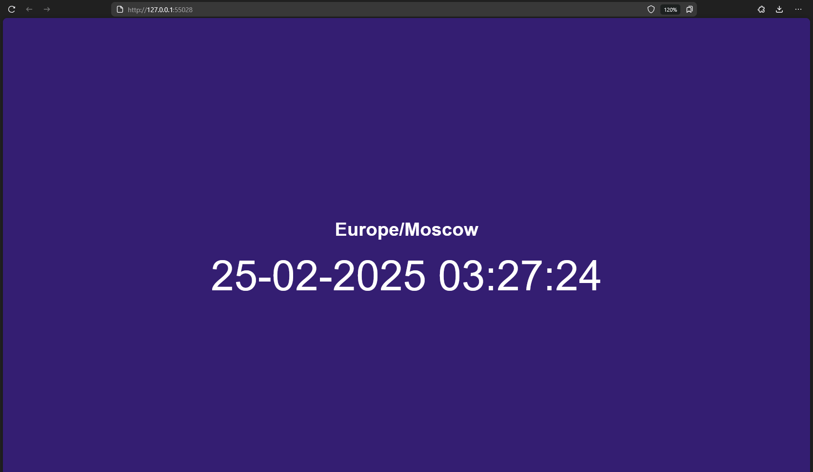

# Kubernetes

## Deploy application

### Create deployment resource

```shell
kubectl create deployment hello-dep --image=innoenjoyer/moscow-time-app:latest
```

```text
deployment.apps/hello-dep created
```

### View the Deployment

```shell
kubectl get deployments
```

```text
NAME        READY   UP-TO-DATE   AVAILABLE   AGE
hello-dep   0/1     1            0           21s
```

### Create service resource

```shell
kubectl expose deployment hello-dep --type=LoadBalancer --port=5000
```

```text
service/hello-dep exposed
```

### View Pods & Services

```shell
kubectl get pods,svc
```

```text
NAME                             READY   STATUS    RESTARTS   AGE
pod/hello-dep-65bb8cf69f-xsf77   1/1     Running   0          6m58s

NAME                 TYPE           CLUSTER-IP       EXTERNAL-IP   PORT(S)          AGE
service/hello-dep    LoadBalancer   10.103.139.169   <pending>     5000:32728/TCP   3m55s
service/kubernetes   ClusterIP      10.96.0.1        <none>        443/TCP          7m33s
```

### Show URL for service

```shell
minikube service hello-dep
```

```text
|-----------|-----------|-------------|---------------------------|
| NAMESPACE |   NAME    | TARGET PORT |            URL            |
|-----------|-----------|-------------|---------------------------|
| default   | hello-dep |        5000 | http://192.168.49.2:32728 |
|-----------|-----------|-------------|---------------------------|
* Starting tunnel for service hello-dep.
|-----------|-----------|-------------|------------------------|
| NAMESPACE |   NAME    | TARGET PORT |          URL           |
|-----------|-----------|-------------|------------------------|
| default   | hello-dep |             | http://127.0.0.1:56464 |
|-----------|-----------|-------------|------------------------|
* Opening service default/hello-dep in default browser...
```

### Cleanup resources

```shell
kubectl delete deployment,service hello-dep hello-dep
```

```text
deployment.apps "hello-dep" deleted
service "hello-dep" deleted
```

## Declarative way

### Apply manifests

```shell
cd k8s
kubectl apply -f .
```

```text
deployment.apps/app-deployment created
service/app-service created
```

### View Pods & Services

```shell
kubectl get svc,pods
```

```text
NAME                  TYPE           CLUSTER-IP     EXTERNAL-IP   PORT(S)          AGE
service/app-service   LoadBalancer   10.106.24.34   <pending>     5000:30698/TCP   32s
service/kubernetes    ClusterIP      10.96.0.1      <none>        443/TCP          42m

NAME                                  READY   STATUS    RESTARTS   AGE
pod/app-deployment-76497f5457-6gnmr   1/1     Running   0          31s
pod/app-deployment-76497f5457-kbqgq   1/1     Running   0          31s
pod/app-deployment-76497f5457-mtgk8   1/1     Running   0          31s
```

### Show URL for service

```shell
minikube service --all
```

```text
|-----------|-------------|-------------|---------------------------|
| NAMESPACE |    NAME     | TARGET PORT |            URL            |
|-----------|-------------|-------------|---------------------------|
| default   | app-service |        5000 | http://192.168.49.2:30698 |
|-----------|-------------|-------------|---------------------------|
|-----------|------------|-------------|--------------|
| NAMESPACE |    NAME    | TARGET PORT |     URL      |
|-----------|------------|-------------|--------------|
| default   | kubernetes |             | No node port |
|-----------|------------|-------------|--------------|
* service default/kubernetes has no node port
! Services [default/kubernetes] have type "ClusterIP" not meant to be exposed, however for local development minikube allows you to access this !
* Starting tunnel for service app-service.
* Starting tunnel for service kubernetes.
|-----------|-------------|-------------|------------------------|
| NAMESPACE |    NAME     | TARGET PORT |          URL           |
|-----------|-------------|-------------|------------------------|
| default   | app-service |             | http://127.0.0.1:55028 |
| default   | kubernetes  |             | http://127.0.0.1:55030 |
|-----------|-------------|-------------|------------------------|
* Opening service default/app-service in default browser...
* Opening service default/kubernetes in default browser...
```

