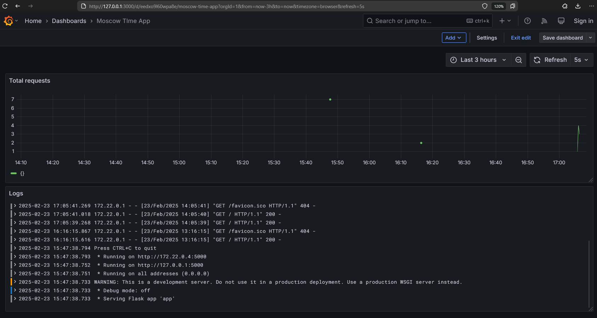

# Monitoring

## Loki

Loki is a log aggregation system

- Central log storage component
- Uses local configuration (`local-config.yaml`) with persistent storage via Docker volume `loki_data`
- Exposes port `3100` for API access
- Receives logs from Promtail through `loki` network

## Promtail

Promtail is a log collection agent that ships logs to Loki

- Scrapes logs from `/var/logs` and `/var/lib/docker/containers`
- Uses configuration from `promtail.yml` to define scraping targets
- Forwards logs to Loki

## Grafana

Grafana is an analytics UI platform used for log visualization:

- Exposes web interface on port `3000`
- Connects to Loki to catch logs

## Screenshots

### Moscow Time App dashboard

